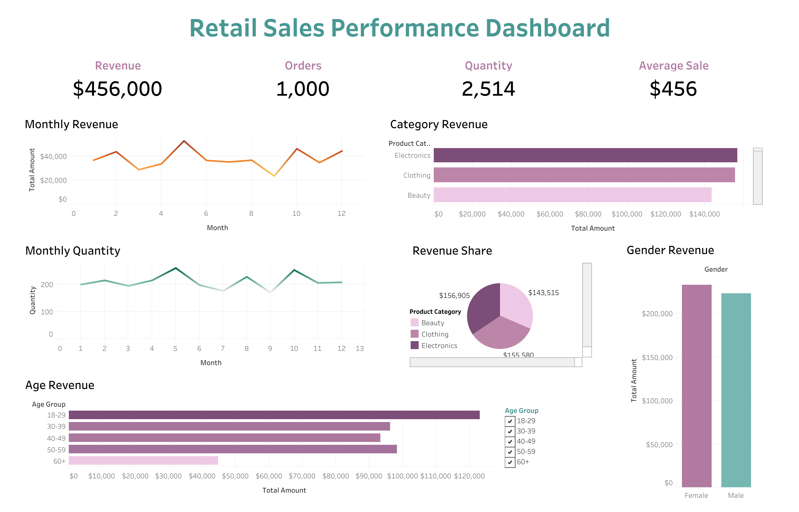

# Retail Sales Performance Analysis
Interactive retail sales analysis using **Python, Pandas, Seaborn, Matplotlib, and Tableau Public** to identify customer purchasing patterns, sales trends, and business insights.

# Dashboard Preview

# Live Dashboard

View the interactive Tableau dashboard here:

**Tableau Public**

https://public.tableau.com/app/profile/thi.thanh.tam.khuat/vizzes

# Project Summary

| Item | Details |
|------|---------|
| Dataset | 1,000 Retail Transactions |
| Dashboard | Interactive Tableau Dashboard |
| Analysis | Python |
| Visualisations | 7 Business Charts |
| Purpose | Retail Sales Performance Analysis |

## Project Objectives
- Clean and prepare raw sales data for analysis.
- Explore customer purchasing behaviour using Python.
- Identify sales trends and performance across customer segments.
- Build an interactive dashboard for business reporting.

## Dataset
The dataset contains 1,000 retail sales transactions collected over one year.
Each record includes:
- Transaction ID
- Date
- Customer ID
- Gender
- Age
- Product Category
- Quantity
- Price per Unit
- Total Amount

## Tools & Technologies
**Programming**
- Python

**Data Analysis**
- Pandas

**Data Visualisation**
- Matplotlib
- Seaborn
- Tableau Public

**Development Environment**
- Jupyter Notebook
- Visual Studio Code

**Version Control**
- Git
- GitHub

## Project Workflow

### 1. Data Preparation
The first notebook prepares the dataset before analysis. The main tasks include:
- Loading the raw dataset
- Checking data quality
- Handling missing values
- Removing duplicate records
- Standardising column names
- Converting date fields
- Creating new time-based features
- Validating calculated sales values
- Exporting the cleaned dataset

### 2. Exploratory Data Analysis
Business questions answered include:
- Which product category generated the highest revenue?
- How did revenue change each month?
- Did purchasing behaviour differ by gender?
- Which age group contributed the most revenue?
- Which product category achieved the highest average sale?
- How many products were sold each month?
- Which variables were most strongly correlated with sales?

### 3. Dashboard Development
An interactive Tableau dashboard was developed to visualise:
- Sales KPIs
- Monthly revenue trend
- Monthly quantity sold
- Revenue by product category
- Revenue by gender
- Revenue by age group
- Revenue share by category

## Key Findings
Some important findings from the analysis include:
- Electronics generated the highest total revenue.
- Revenue was highest in May and lowest in September.
- Female customers spent slightly more than male customers.
- Customers aged 18–29 generated the highest total revenue.
- Beauty products had the highest average revenue per transaction.
- Price per unit showed the strongest relationship with total revenue.

## Project Structure
The project produces the following deliverables:
| File | Description |
|------|-------------|
| `notebooks/01_data_cleaning.ipynb` | Data cleaning, preprocessing, feature engineering, and exporting the cleaned dataset. |
| `notebooks/02_business_insights.ipynb` | Exploratory data analysis (EDA), business insights, and visualisations. |
| `data/cleaned/retail_sales_cleaned.csv` | Cleaned dataset used for analysis and dashboard development. |
| `dashboard/Sales Dashboard.twb` | Interactive Tableau dashboard containing KPIs, trends, and customer insights. |
| `images/dashboard.png` | Dashboard preview image used in the project documentation. |
| `README.md` | Project documentation, workflow, methodology, and key findings. |

## Dashboard Features
- Interactive dashboard filters
- KPI summary cards
- Revenue trend analysis
- Product category analysis
- Customer demographic insights
- Cross-chart filtering using Tableau dashboard actions

## Future Improvements
- Add SQL queries for business reporting.
- Apply customer segmentation using clustering techniques.
- Develop sales forecasting models with machine learning.
- Connect the dashboard to a live database.

# Live Dashboard
**Tableau Public**
https://public.tableau.com/app/profile/thi.thanh.tam.khuat/vizzes

# Repository
**GitHub**
https://github.com/Gracekhuat/Retail-sales-performance-analysis

## Author
**Thi Thanh Tam Khuat (Grace)**

- LinkedIn: *https://www.linkedin.com/in/tamkhuat/*

- GitHub: *https://github.com/Gracekhuat*
